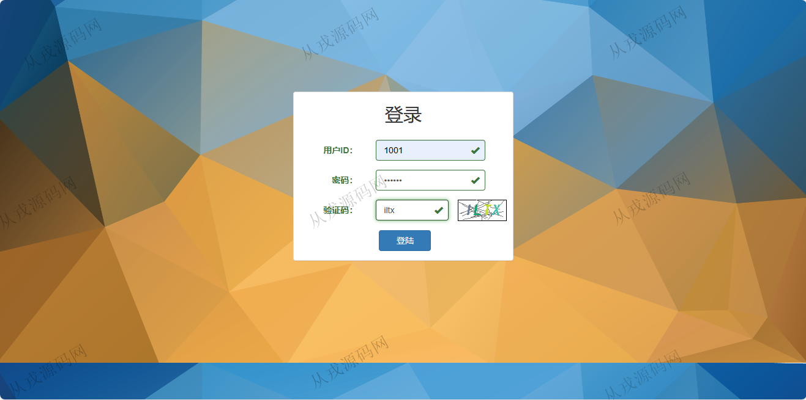
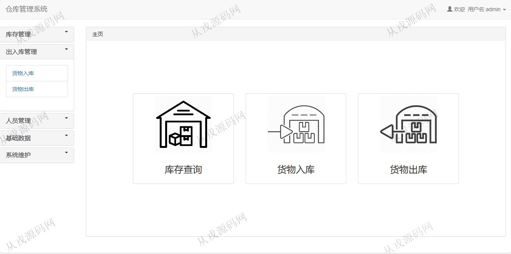
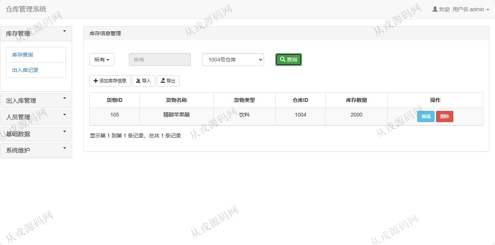
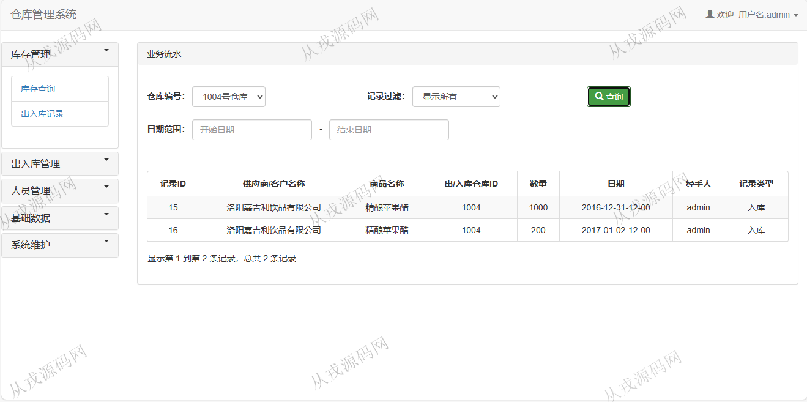
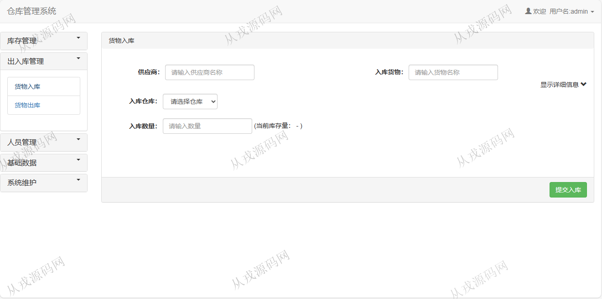
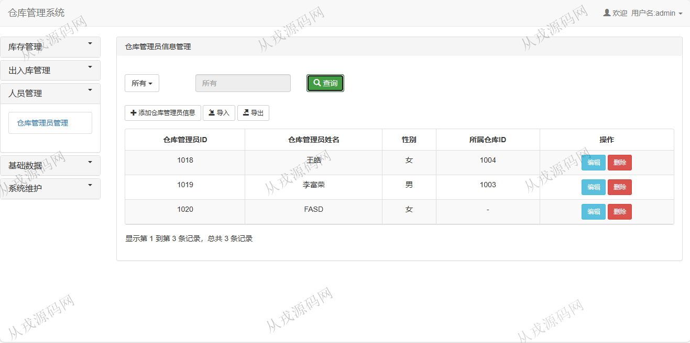
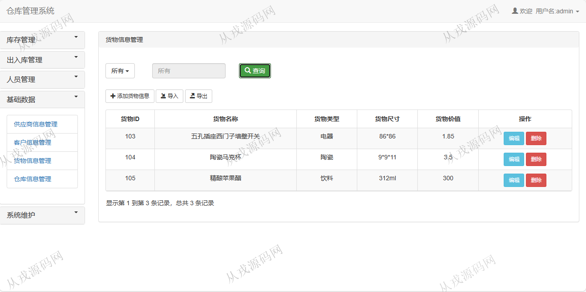
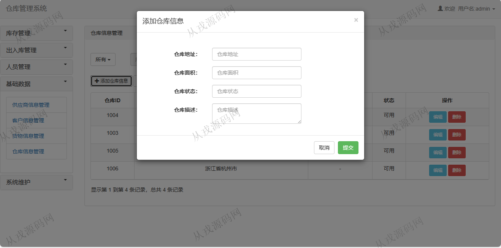

<h1 align="center">77.仓库管理系统</h1>

 获取sql文件 QQ: 386869957 QQ群: 377586148 

 [推荐站点: 从戎源码网](https://armycodes.com/) 

## 简介

> 本代码来源于网络,仅供学习参考使用!
>
> 提供1.远程部署/2.修改代码/3.设计文档指导/4.框架代码讲解等服务
>
> 登录地址：http://localhost:8080/login
>
> 用户名：1018   密码: 123456
>
> 管理员: 1001   密码: 123456
> 

## 项目介绍
基于ssm的仓库管理系统：前端jsp、jquery、bootstrap，后端 maven、springmvc、spring、mybatis，集成库存管理、出入库管理、供应商信息管理、货物信息管理等功能于一体的系统。

## 功能介绍

- 库存管理：库存信息的增删改查，出入库记录查询，多条件搜索查询
- 出入库管理：货物入库，入库时选择对应的仓库下拉列表，填入供应商名称和入库货物名称，输入入库数量；货物出库则类似货物入库
- 人员管理：仓库管理员信息的增删改查，导入，导出
- 供应商信息管理：供应商增删改查，关键词搜索
- 客户信息管理：客户信息增删改查，导入，导出
- 货物信息管理：货物信息的增删改查，导入，导出
- 仓库信息管理：仓库信息的增删改查，导入，导出
- 系统维护：更改密码，系统日志查询，登录日志查询

## 环境

- <b>IntelliJ IDEA 2009.3</b>

- <b>Mysql 5.7.26</b>

- <b>Tomcat 7.0.73</b>

- <b>JDK 1.8</b>

## 运行截图

